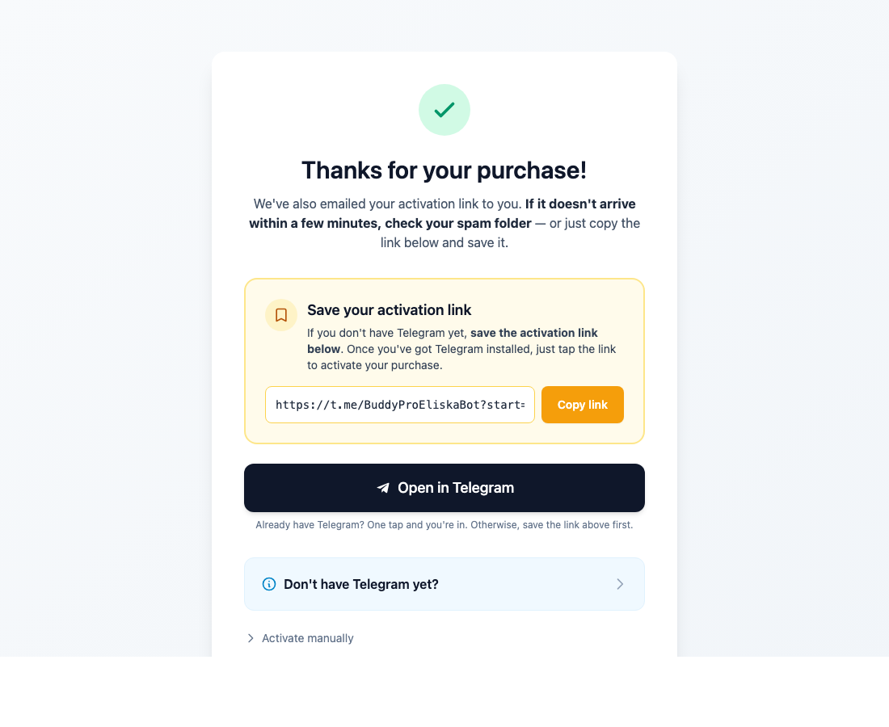
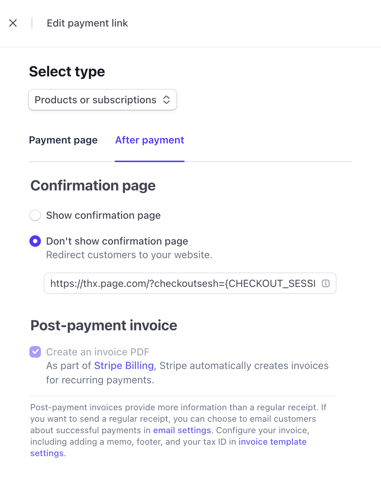

# BuddyPro Stripe Thanks Page

A drop-in branded thank-you page that BuddyPro owners use as their Stripe Checkout success URL. After a buyer completes payment, they land here, the page looks up their Stripe checkout session, and shows them a one-click button to activate their access in Telegram.

Built with [Nitro](https://nitro.build) so you can deploy it to Vercel, Cloudflare Workers, plain Node, Bun, or Netlify by changing a single config flag.



## How it works

1. In your Stripe payment link, edit it and on the **After payment** tab choose **Don't show confirmation page**, then enter your deployed thanks-page URL:
   ```
   https://thanks.buddypro.ai/?checkoutsesh={CHECKOUT_SESSION_ID}
   ```
   (Replace the domain with wherever you deploy this. The `{CHECKOUT_SESSION_ID}` placeholder is filled by Stripe automatically — see [Stripe docs on `success_url`](https://docs.stripe.com/api/checkout/sessions/create#create_checkout_session-success_url).)

   

2. After payment, the buyer lands on the thanks page.
3. The page calls `GET /api/activation?checkoutsesh=cs_…`, which uses the Stripe Secret Key to retrieve the session and derive the BuddyPro activation code.
4. The buyer clicks the **Open in Telegram** button and is dropped into your bot with the activation code prefilled.

The activation link is `https://t.me/{BOT_USERNAME}?start=STRIPE_{invoice_or_payment_intent_id}`.

## Setup

```bash
cd connectors/buddypro-stripe-thanks-page
npm install
cp .env.example .env
# edit .env — fill in your Stripe key + bot username
npm run dev
```

Open http://localhost:3000/?checkoutsesh=cs_test_… with a real test session ID to verify.

## Environment variables

| Var                        | Required | What it is                                                                                  |
| -------------------------- | -------- | ------------------------------------------------------------------------------------------- |
| `NITRO_STRIPE_SECRET_KEY`  | Yes      | Your Stripe secret key (`sk_live_…` or `sk_test_…`). Used server-side only — never exposed. |
| `NITRO_BOT_USERNAME`       | Yes      | Your Telegram bot username, no leading `@`. Used to build the `t.me/{username}` link.       |
| `NITRO_WELCOME_VIDEO_URL`  | No       | If set, an embedded video is rendered under the activation link. Supports YouTube (watch / `youtu.be` / shorts), Vimeo, and direct video file URLs (`.mp4`, `.webm`). Leave unset to hide the embed. |

> Nitro maps `NITRO_*` env vars onto runtime config automatically. If you prefer the bare names (`STRIPE_SECRET_KEY`, `BOT_USERNAME`), you can also set those — Nitro picks them up via `runtimeConfig` defaults.

## API

### `GET /api/activation?checkoutsesh=<session_id>`

**200 OK**
```json
{
  "activationUrl": "https://t.me/YourBot?start=STRIPE_in_1Abc...",
  "activationCode": "STRIPE_in_1Abc...",
  "botUsername": "YourBot",
  "mode": "subscription",
  "source": "invoice",
  "welcomeVideoUrl": null
}
```

| Status | Meaning                                                                                |
| ------ | -------------------------------------------------------------------------------------- |
| 400    | `checkoutsesh` query param is missing                                                   |
| 402    | Session exists but payment isn't complete (`payment_status !== 'paid'`)                 |
| 404    | Stripe doesn't recognize the session ID                                                 |
| 500    | Server is missing `NITRO_STRIPE_SECRET_KEY` or `NITRO_BOT_USERNAME`                     |
| 502    | Other Stripe error                                                                      |

## Project structure

```
.
├── routes/api/activation.get.ts   # API handler
├── utils/activation.ts             # Pure: deriveActivationId, buildActivationUrl
├── public/index.html               # Static thank-you page (Tailwind via CDN)
├── nitro.config.ts                 # Preset + runtime config
├── package.json
└── tsconfig.json
```

## Deploying

### Vercel (default preset)

```bash
npm run build
npx vercel
```

Set `NITRO_STRIPE_SECRET_KEY` and `NITRO_BOT_USERNAME` in the Vercel dashboard. Use `printf` (not `echo`) when adding env vars via CLI to avoid trailing newlines:

```bash
printf 'sk_live_…' | npx vercel env add NITRO_STRIPE_SECRET_KEY production
printf 'YourBot'    | npx vercel env add NITRO_BOT_USERNAME production
```

### Other platforms

Edit `nitro.config.ts` and change `preset` to one of:

- `cloudflare-pages` — Cloudflare Workers
- `node-server` — plain Node behind nginx/Caddy
- `bun` — Bun runtime
- `netlify` — Netlify Functions
- `aws-lambda` — AWS Lambda

Full list: [nitro.build/deploy](https://nitro.build/deploy).

## Customizing the page

Edit `public/index.html` directly. It's intentionally a single self-contained file — no build step. Replace the heading, swap the icon, drop in your own logo, change the colors. The only contract is that the JS at the bottom expects three element IDs (`loading`, `success`, `error`) and the `activate-btn` + `activation-code` inside `success`.

## Open source

This connector is meant to be forked and self-deployed. Owners who want full control over their checkout flow can:

1. Fork the repo
2. Edit `public/index.html` to match their brand
3. Deploy to their own domain
4. Set their own Stripe key + bot username

The server code is generic — no BuddyPro-specific secrets, no hardcoded domain.

## Security notes

- The Stripe secret key lives only in server-side env vars. Never commit `.env`.
- The page is public. The only "secret" exposed in the URL is the Stripe checkout session ID — but Stripe already issues that to the buyer's browser as part of the redirect, so it's not a new leak.
- If a buyer somehow shares their session URL, the activation code is single-use (BuddyPro's `/start STRIPE_…` handler binds it to whichever Telegram account redeems it first).
